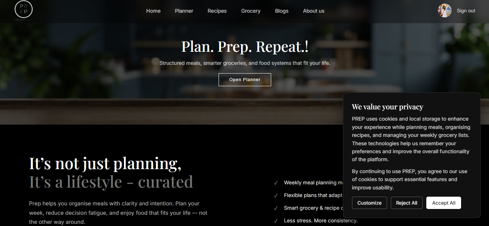
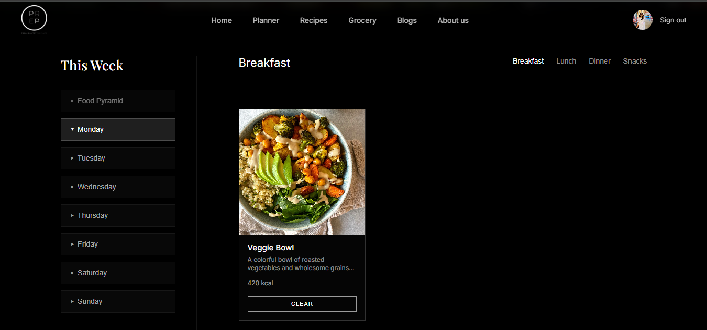
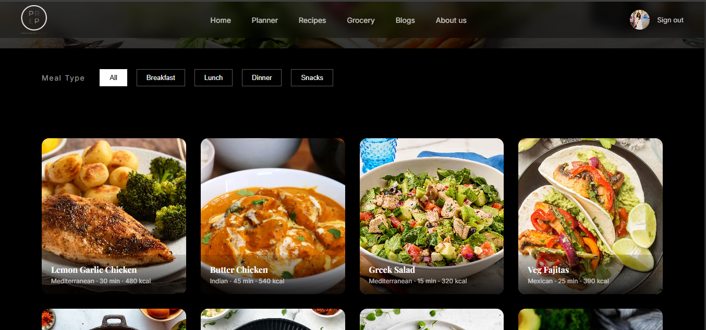
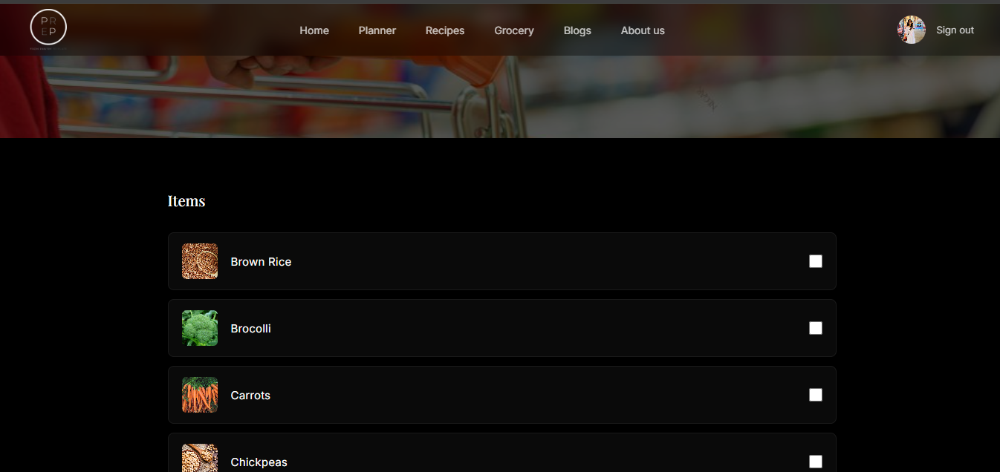

🍽️ PREP — Smart Meal Planner

PREP is a full-stack MERN meal planner web application that helps users organize weekly meals, explore recipes, and automatically 
generate grocery lists based on selected meals.The platform simplifies meal planning by combining recipe browsing, weekly planning, 
and grocery management into a single interface.

Live Application: https://prep-app-neon.vercel.app

📸 Screenshots:

  
  

  
  

🧰 Tech Stack
Frontend

React

React Router

CSS

Backend

Node.js

Express.js

Database

MongoDB

MongoDB Atlas

Authentication

JWT (JSON Web Tokens)

Email Service

Resend API

Deployment

Frontend hosted on Vercel

Backend hosted on Render

Database hosted on MongoDB Atlas

🏗️ Architecture Overview

The application follows a MERN stack architecture:

React Frontend
      │
      ▼
REST APIs (Node + Express)
      │
      ▼
MongoDB Database

The React frontend handles UI rendering, routing, and user interactions.

The Node.js + Express backend provides REST APIs for authentication, recipes, planners, and grocery lists.

MongoDB stores users, recipes, meal plans, and grocery list data.

📂 Project Structure
prep
│
├── frontend
│   ├── src
│   │   ├── components
│   │   ├── pages
│   │   ├── context
│   │   └── styles
│
├── backend
│   ├── controllers
│   ├── routes
│   ├── models
│   └── middleware
│
└── README.md
⚙️ Getting Started
Clone the Repository
git clone https://github.com/yourusername/prep.git
📦 Install Dependencies
Frontend
cd frontend
npm install
Backend
cd backend
npm install
🔑 Environment Variables

Create a .env file inside the backend folder.

PORT=5000
MONGO_URI=your_mongodb_connection_string
JWT_SECRET=your_secret_key
RESEND_API_KEY=your_resend_api_key
CLIENT_URL=http://localhost:5173

Create a .env file inside the frontend folder.

VITE_API_URL=http://localhost:5000
▶️ Run the Application
Start Backend
cd backend
npm run dev
Start Frontend
cd frontend
npm run dev

Open the application in your browser:

http://localhost:5173
🚀 Future Improvements

Nutritional analysis for recipes

Drag-and-drop weekly planner

Grocery list export (PDF)

Social login (Google / GitHub)

Recipe recommendation system

👩‍💻 Author

Chaithra Hegde
MERN Stack Developer

GitHub: https://github.com/yourusername

Portfolio: https://chai0405.github.io/portfolio/

📜 License
This project is created for learning and portfolio purposes.
